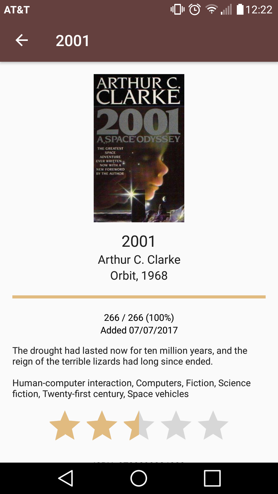

# About Booket List

Booket List can easily create and update reading lists.

* View book details like descriptions, tags, and publish date in the details view
* Use the book search to automatically and easily find book details by title or author
* Keep track of your reading speed and current page location in your books to see how much you have left and when you will finish your current book
* Rate your books to remember which you liked, and sort by rating to easily find your favorites again
* Sort by progress to decide which book to finish next

# Get Booket List

Booket List is available on the [Play Store](https://play.google.com/store/apps/details?id=com.chesak.adam.readinglist&hl=en).

# License

Booket List is released under the [GNU General Public License version 3](https://www.gnu.org/licenses/gpl-3.0.txt). See the `LICENSE.md` file for more information.

Icons:
* App icon designed by Paomedia, available under [Creative Commons (Attribution 3.0 Unported)](https://creativecommons.org/licenses/by/3.0/).
* Icons designed by [Freepik](http://www.flaticon.com/authors/freepik) from flaticon.com.
